# KaviGo

**KaviGo** is a simple Go-based CLI tool that automatically renames files to match the naming conventions required by [Kavita](https://github.com/Kareadita/Kavita), helping you keep your manga library better organized.



Kavita is easily one of my favorite open-source projects, but the only downside I had with it was that I had to manually copy files over to the correct directory on the server. Additionally, if I wanted to use Volumes, I had to manually rename hundreds of files.
So it seamed like a really good excuse to learn Go, I'm not much of a programmer (my favorite language is YAML) but I'm really proud of the end result even though the code is kind of a mess.

**KaviGo** renames manga chapters to a standardized naming convention. This ensures Kavita can properly parse the volume and chapter numbers, and even handle special chapters (see "Known Limitations" for more details).

I mostly get my manga from the [Haku Neko](https://github.com/manga-download/hakuneko) Mangasee123 connector. If you're using a different source with a different naming convention, this tool may not work as expected. However, if your manga chapters are organized in a directory with the manga's name and the chapter filenames include a number representing the chapter, it should work fine.


## Usage

Download the binary and run it using the following command:

```bash
./kavigo -d /path/to/source -o /path/to/destination -r /path/to/ranges.file -v -p
```
In v3.0.0 and above a config file can also be used instead of flags and a ranges file. By default it looks for a `kavigo.yaml` in the same directory as the executable or with the `-c` flag a config file can be passed in from a custom location.
```bash
./kavigo -c /path/to/config.yaml
```

### Flags

| Flag | Description                                                                                                                  | Required |
| ---- | ---------------------------------------------------------------------------------------------------------------------------- | -------- |
| `-d` | Path to the source directory containing manga chapters (directory name should be the name of the manga)                      | Yes      |
| `-o` | Path to the destination directory. If not provided, files will remain in the source directory                                | Optional |
| `-r` | Path to the Volume ranges file (comma-delimited). [Why?](#required-volume-ranges-file) , [example](./misc/volRanges.example) | Yes      |
| `-v` | Verbose output                                                                                                               | Optional |
| `-p` | Preserve original files                                                                                                      | Optional |
| `-s` |  ~~Mark special chapters as special. See  [Special Chapters](#special-chapters) for more info.~~ Removed in v2.0.0           | Optional |
| `-c` | Define a custom config file location. By default it looks for `./kavigo.yaml` in the same directory as the executable        | Optional |

### Config File example 

```yaml
directories:
  manga: /home/vktr/Documents/Mangas/Zom 100 - Bucket List of the Dead
  destination: /tmp    # Optional, BUT IF copying to remote use this to define remote path 
options:
  verbosity: true 
  preserve: true
  copytoremote: false
remote:
  host: IP/hostname
  port: 22
  user: sshUser
  password:     # if ssh key is used this is not needed
  sshkey:       #path/to/sshkey, if password is used this is not needed 
ranges: | #First number: first chapter in the volume. Second: last chapter in volume. Third: Volume number
  1,5,1
  6,15,2
  16,25,3
  26,35,4
  36,45,5
  46,55,6
  56,64,7
  65,74,8
```

## Limitations / Known Issues

### Required Volume Ranges File

Since I couldn't find an easily accessible API that provides the volume number for each chapter, I decided on a manual approach. You must provide a comma-delimited file that specifies the first and last chapters of each volume, along with the corresponding volume number. Use the `-r` (ranges) flag to specify the location of this file. See [example](./misc/volRanges.example)


### ~~Special Chapters~~ Removed in v2.0.0

Kavita handles special chapters weirdly or I didn't grasp the idea of how to use them(). My expectation was that if I named the file like `manga_name_v4_chp24.5_SP1.cbz`, it would be added to both the fourth volume to the end and the "Special" tab as well, showing the volume and chapter number along with the special chapter number. Unfortunately, this wasn't the case.

The most "acceptable" solution I could think of was to set both the chapter (`chp`) and special episode (`SP`) numbers to the same value, that way it's added to the special tab and it indicates the chapter number. Special episodes will only be generated if you use the `-s` flag, but I don't recommend it.
